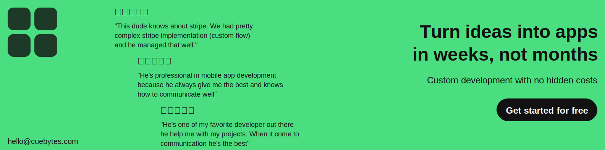

# 👋 Hello, I'm Shahid! 

### 🚀 Fullstack Flutter Developer | Node.js Enthusiast | Mobile App Wizard

[Profile views](https://gpvc.arturio.dev/shahidBangash)

---

## 🙋‍♂️ About Me 

I'm a passionate developer with a knack for creating diverse, user-centric mobile applications using Flutter. My expertise extends to Node.js, where I build robust APIs to support seamless app functionality. When I'm not coding, I enjoy sharing my knowledge about tech and mobile app development through writing.

- 🏗️ Currently working with Serverless technologies
- 📚 Learning Bloc and DevOps
- 👥 Looking to collaborate on Mobile, Web, and Backend Projects
- 🤝 Seeking help with my open source projects
- 📧 Reach me at: [shahid@cuebytes.com](mailto:shahid@cuebytes.com)

---

## 💼 Featured Projects

1. **SNOW.LIMO Rider & Driver Apps**
   - On-demand luxury transportation platform
   - Connects users with legally registered black car & limo companies
   - Features: Pre-scheduled rides, real-time tracking, driver app
   - [iOS App](https://apps.apple.com/us/app/snow-limo-rider/id6476261442)
   - [Android App](https://play.google.com/store/apps/details?id=limo.snow.snowlimodriver)

2. **Saropa Contacts**
   - Cloud-connected address book for emergency services
   - Links people, companies, and emergency services
   - Real-time access to important contacts in emergencies
   - [iOS App](https://apps.apple.com/us/app/saropa-contacts/id6447379943)

3. **Commo Partners & Commo Marketplace**
   - Service provider app and marketplace for users in Finland
   - Connects service providers with customers
   - [Commo Provider App](https://play.google.com/store/apps/details?id=com.providercommo.app&hl=en_US)
   - [Commo User App](https://play.google.com/store/apps/details?id=com.usercommo.app&hl=en_US)

4. **Inmessage: Chat. Meet. Date**
   - Social networking and dating app
   - [iOS App](https://apps.apple.com/us/app/7pm-connect-meet-chat-date/id1660313753)

5. **Veco Buyer**
   - E-commerce app for buyers/users

6. **Plafood**
   - Platform for exclusive restaurant deals and discounts
   - Connects users with local restaurants through food bloggers
   - [iOS App](https://apps.apple.com/hu/app/plafood/id6447640589?platform=iphone)

7. **Social Meet**
   - Ultimate dating and social networking app
   - Features: Effortless matching, real conversations, global connections
   - Advanced search filters and personalized profiles
   - [Android App](https://play.google.com/store/apps/details?id=com.socialmeet.app)

8. **Fit Switch**
   - Home workout and fat-burning exercise app
   - Personalized workout plans for all fitness levels
   - No-equipment exercises targeting core, legs, arms, and abs
   - Professional guidance with step-by-step instructions and animations
   - Variety of workouts: HIIT, cardio, strength training, and more
   - [Android App](https://play.google.com/store/apps/details?id=com.cuebytes.fitswitch)

---

## 🛠️ Tech Stack

- **Languages:** 
  
  
  

- **Frameworks:** 
  
  
  

- **Tools:** 
  
  
  

---

## 📊 GitHub Stats

  

---

## 🤝 Let's Connect

&nbsp;&nbsp;
&nbsp;&nbsp;

---

